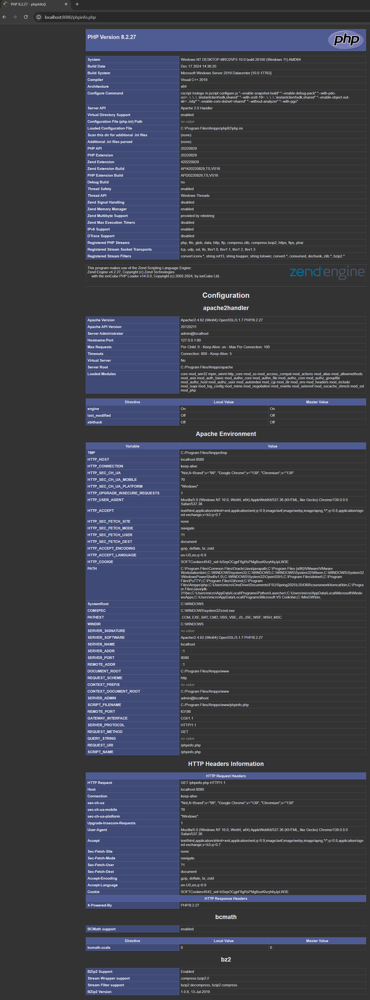
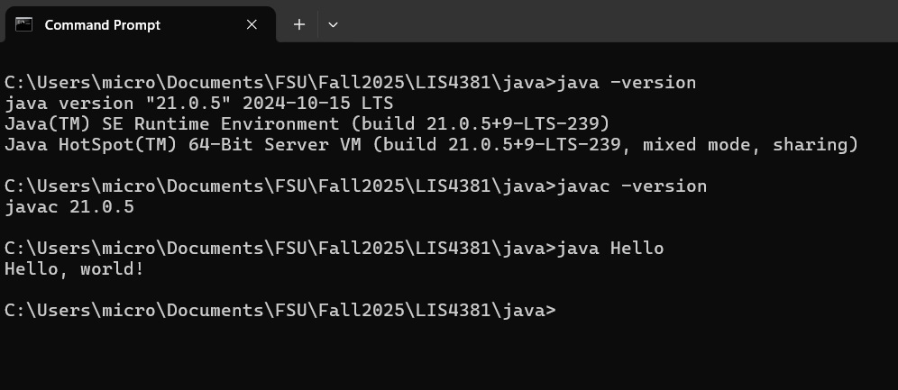
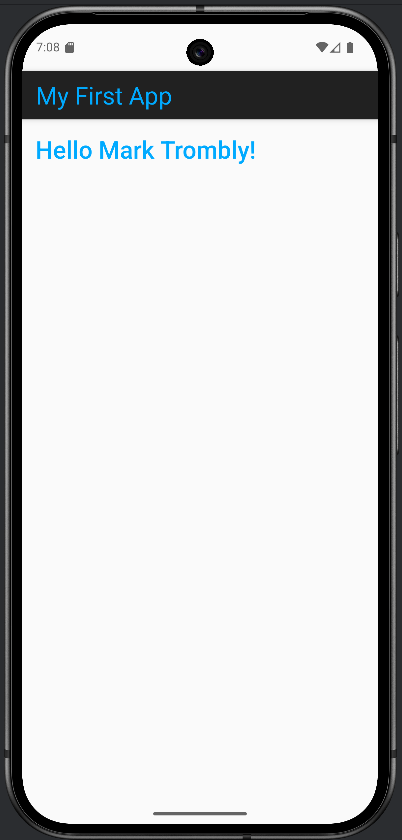

# LIS4381 - Mobile Web Application Development

## Mark Trombly

### Assignment #1 Requirements:

*Three Parts:*

1. Distributed Version Control with Git and Bitbucket.
2. Development installations
3. Chapter Questions (Ch 1,2)

#### README.md file includes the following items:

* Screenshot of AMPPS Installation [My PHP Installation](img/ampps.png "My PHP Installation")
* Screenshot of running java Hello
* Screenshot of running Andriod Studio - My First App
* git commands w/short descriptions
* Bitbucket repo links a) This assignment and b) The completed above (bitbucketstationlocations and myteamquotes).

#### Git commands w/short descriptions:

1. git init - Create an empty Git repository or reinitialize an existing one
2. git status - Show the working tree status
3. git add - Add file contents to the index
4. git commit - Record changes to the repository
5. git push - Update remote refs along with associated objects
6. git pull - Fetch from and integrate with another repository or a local branch
7. git clone - Clone a repository into a new directory

#### Assignment Screenshots:

*Screenshot of AMPPS running http://localhost*:

*Screenshot of running java Hello*:

*Screenshot of Android Studio - My First App*:

