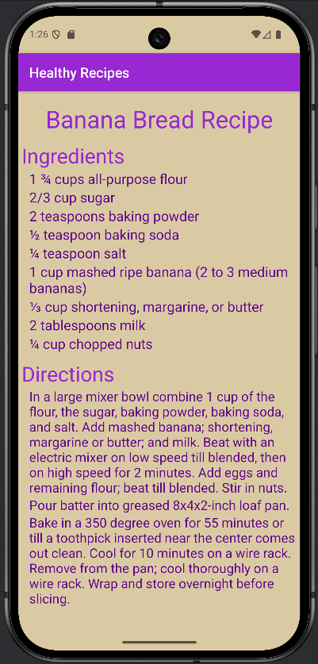

# LIS4381 - Mobile Web Application Development

## Mark Trombly

### Assignment #2 Requirements:

*Five Parts:*

1. Android Studio application - Healthy Recipes.
2. Skillset 1 - Even or Odd.
3. Skillset 2 - Largest Number.
4. Skillset 3 - Arrays and Loops.
5. Chapter Questions (Ch 3,4)

#### README.md file includes the following items:

* Screenshot of running Android Studio application - Healthy Recipes Screen 1
* Screenshot of running Android Studio application - Healthy Recipes Screen 2
* Screenshot Skillset 1 - Even or Odd
* Screenshot Skillset 2 - Largest Number
* Screenshot Skillset 3 - Arrays and Loops
* Bitbucket repository link

#### Assignment Screenshots:

| Screen 1 |       | Screen 2 |
| :--------------------------------------------: | ----- | :--------------------------------------------: |
|  |         |  |

|Skillset 1 - Even or Odd|Skillset 2 - Largest Number|Skillset 3 - Arrays and Loops|
|--------|--------|--------|
|[Link to Skillset 1 Code](../skillsets/1_Even_Or_Odd/ "Link to Skillset 1 Code")|[Link to Skillset 2 Code](../skillsets/2_Largest_Number/ "Link to Skillset 2 Code")|[Link to Skillset 3 Code](../skillsets/3_Arrays_And_Loops/ "Link to Skillset 3 Code") 
||||

#### Repository Links:

*Bitbucket Repository*
[Bitbucket Repository Link](https://bitbucket.org/marktrombly/lis4381/src/master/ "Bitbucket Repository Link")