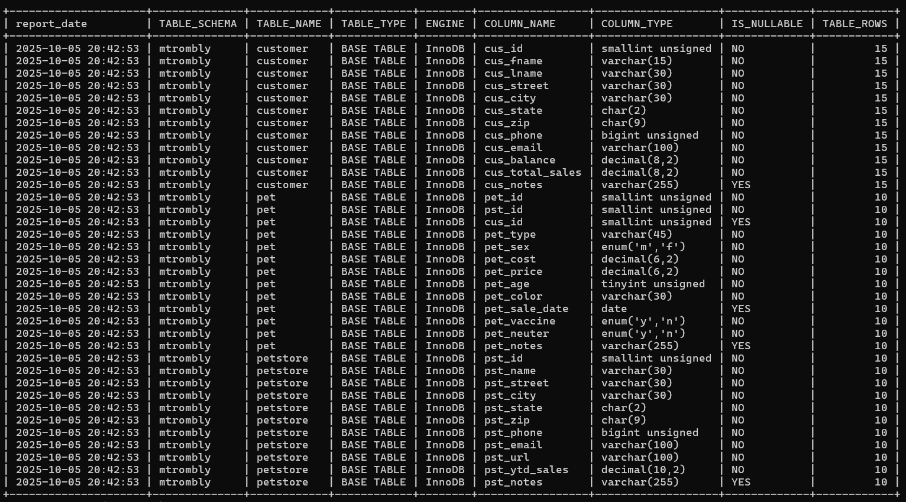
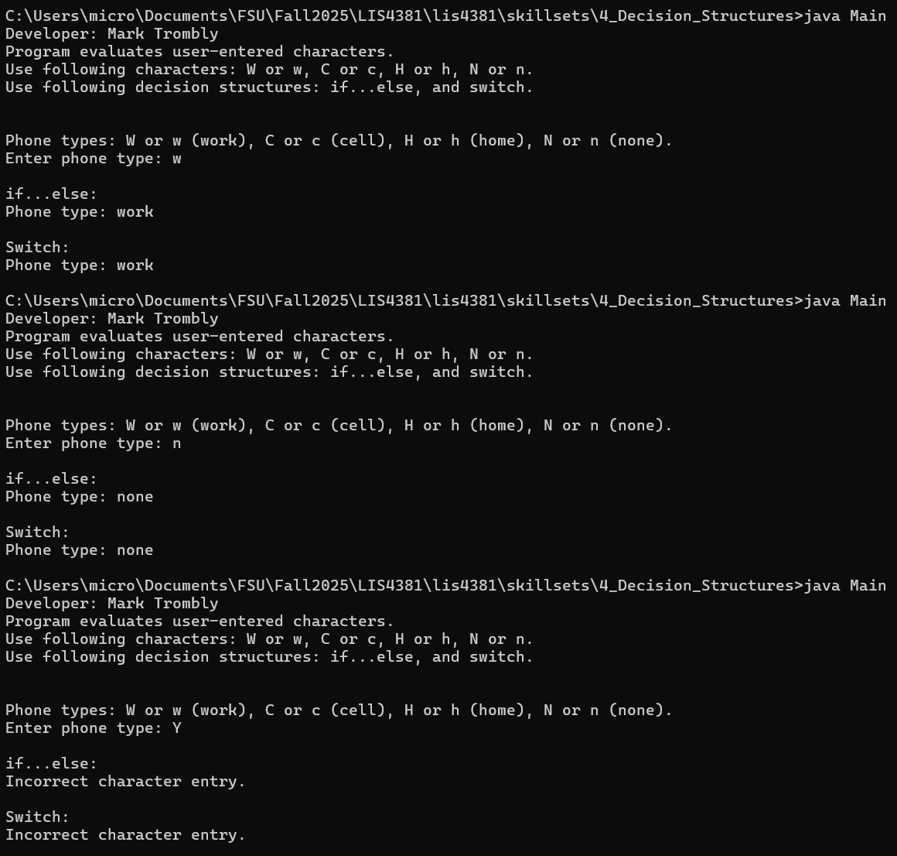
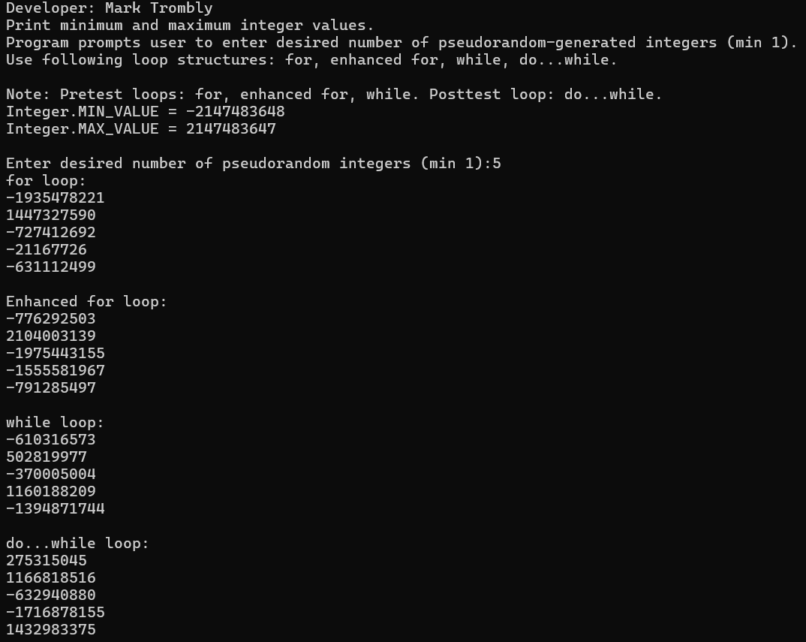
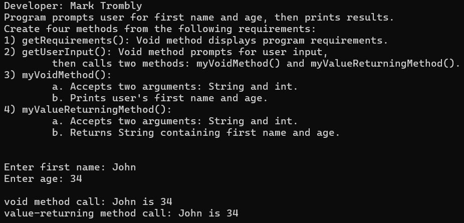

# LIS4381 - Mobile Web Application Development

## Mark Trombly

### Assignment #3 Requirements:

*Six Parts:*

1. Android Studio application - My Event.
2. Create Database using MySQL Workbench and Forward engineer Database.
2. Skillset 4 - Decision Structures.
3. Skillset 5 - Random Number Generator.
4. Skillset 6 - Methods.
5. Chapter Questions (Ch 5,6)

#### README.md file includes the following items:

* Screenshot of ERD
* Screenshot of 10 records for each table
* Link to SQL Workbench model file: a3.mwb
* Link to SQL Script File: a3.sql
* Screenshot of running Android Studio Application -  My Event
* Screenshot Skillset 4 - Decision Structures
* Screenshot Skillset 5 - Random Number Generator
* Screenshot Skillset 6 - Methods
* Bitbucket repository link

#### Assignment Screenshots:

#### Screenshot of ERD:

[Link to A3.mwb](docs/a3.mwb "Link to A3.mwb")

[Link to A3.sql](docs/a3.sql "Link to A3.sql")

#### Screenshot of Data Records:

#### Screenshot of Android Studio Application - My Event:

    

|Skillset 4 - Decision Structures|Skillset 5 - Random Number Generator|Skillset 6 - Methods|
|--------|--------|--------|
|[Link to Skillset 4 Code](../skillsets/4_Decision_Structures/ "Link to Skillset 4 Code")|[Link to Skillset 5 Code](../skillsets/5_Random_Number_Generator/ "Link to Skillset 5 Code")|[Link to Skillset 6 Code](../skillsets/6_Methods/ "Link to Skillset 6 Code") 
||||

#### Repository Links:

*Bitbucket Repository*
[Bitbucket Repository Link](https://bitbucket.org/marktrombly/lis4381/src/master/ "Bitbucket Repository Link")