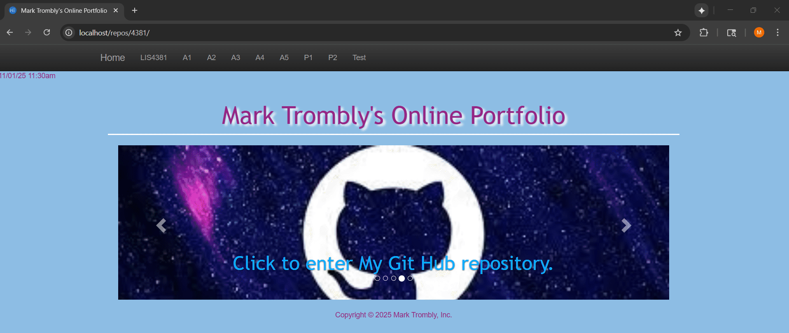
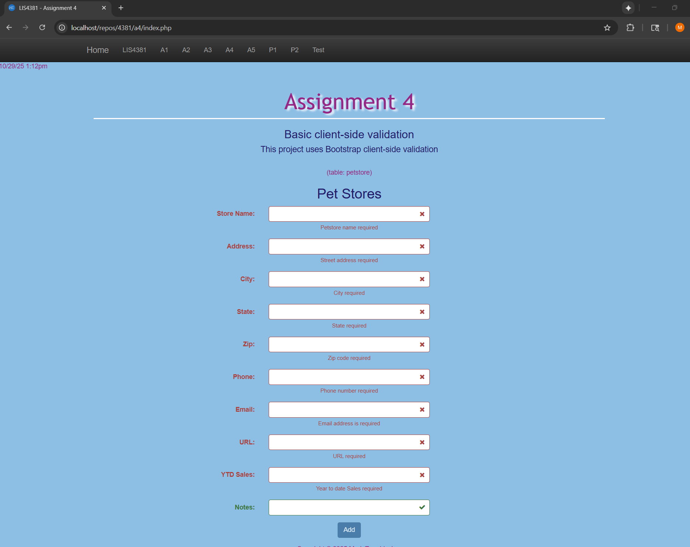
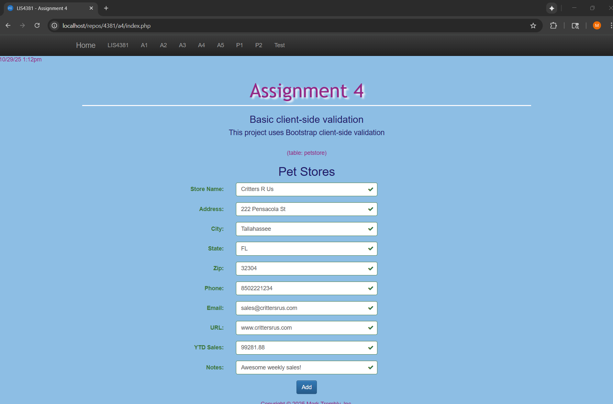
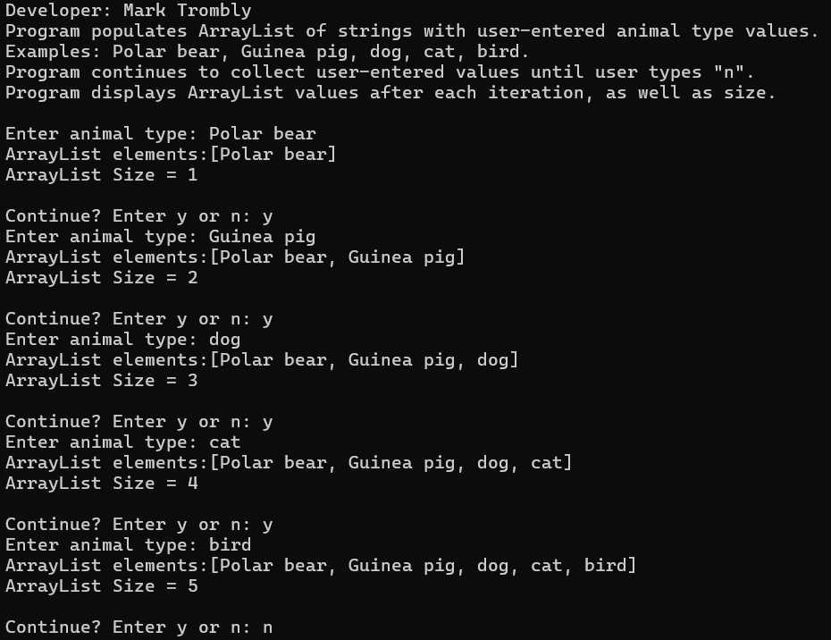
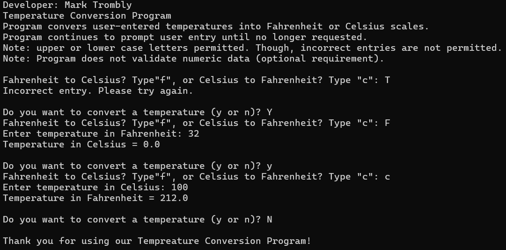

# LIS4381 - Mobile Web Application Development

## Mark Trombly

### Assignment #4 Requirements:

*Six Parts:*

1. Create PHP page using Bootstrap to show client side data validation for petstore entity.
2. Show use of regular expressions.
2. Skillset 10 - Array List
3. Skillset 11 - Alpha Numeric Special
4. Skillset 12 - Temperature Conversion
5. Chapter Questions (Ch 9,10)

#### README.md file includes the following items:

* Screenshot of Main page
* Screenshot of Failed validation
* Screenshot of Passed validation
* Screenshot Skillset 10 - Array List
* Screenshot Skillset 11 - Alpha Numeric Special
* Screenshot Skillset 12 - Temperature Conversion
* Bitbucket repository link

#### Assignment Screenshots:

#### Screenshot of Main page:

#### Screenshot of Failed validation:

#### Screenshots of Passed validation:

#### Skillsets:

|Skillset 10 - Array List|Skillset 11 - Alpha Numeric Special|Skillset 12 - Temperature Conversion|
|--------|--------|--------|
|[Link to Skillset 10 Code](../skillsets/10_Array_List/ "Link to Skillset 10 Code")|[Link to Skillset 11 Code](../skillsets/11_Alpha_Numeric_Special/ "Link to Skillset 11 Code")|[Link to Skillset 12 Code](../skillsets/12_Temperature_Conversion/ "Link to Skillset 12 Code") 
||||

#### Link to Local web app:

*Local Application*
[Local App Link](http://localhost/repos/4381/index.php "Local App Link")

#### Repository Links:

*Bitbucket Repository*
[Bitbucket Repository Link](https://bitbucket.org/marktrombly/lis4381/src/master/ "Bitbucket Repository Link")