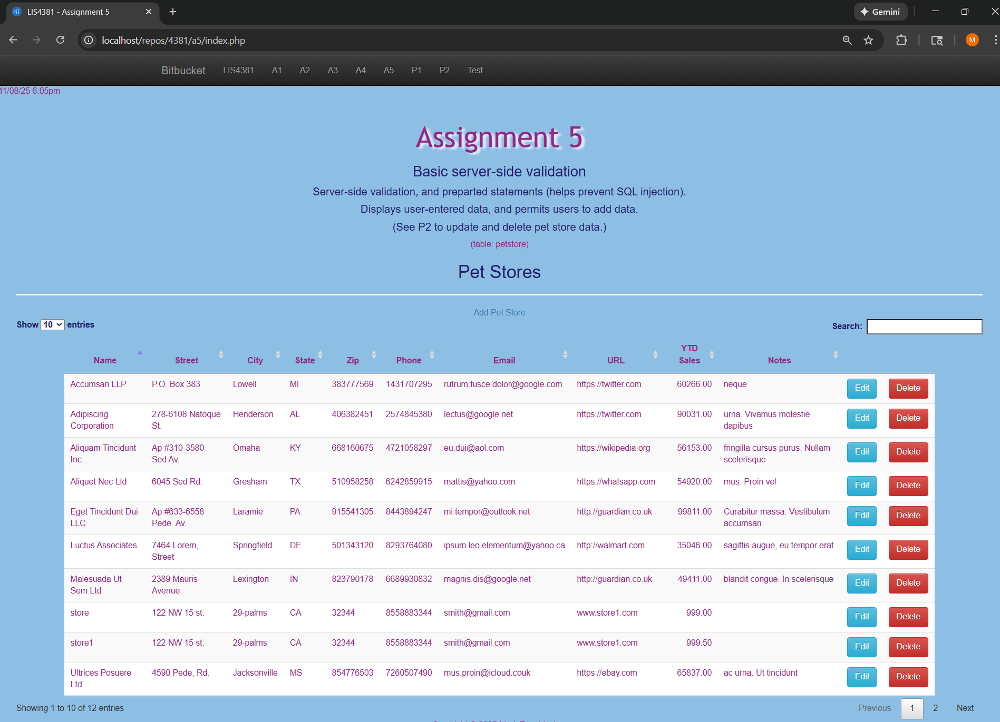
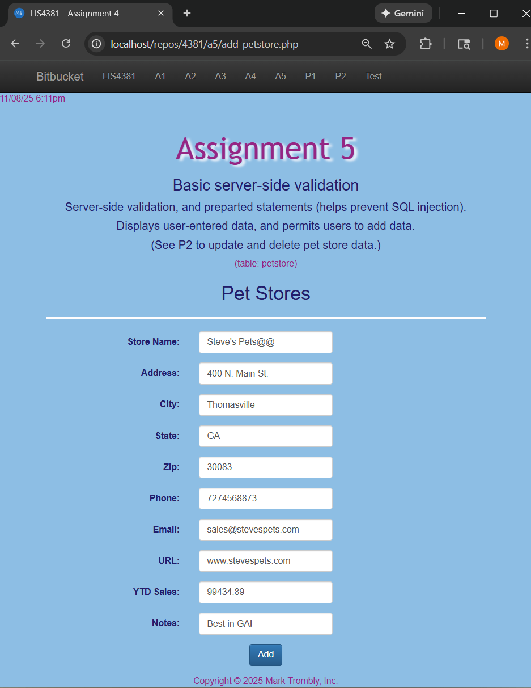
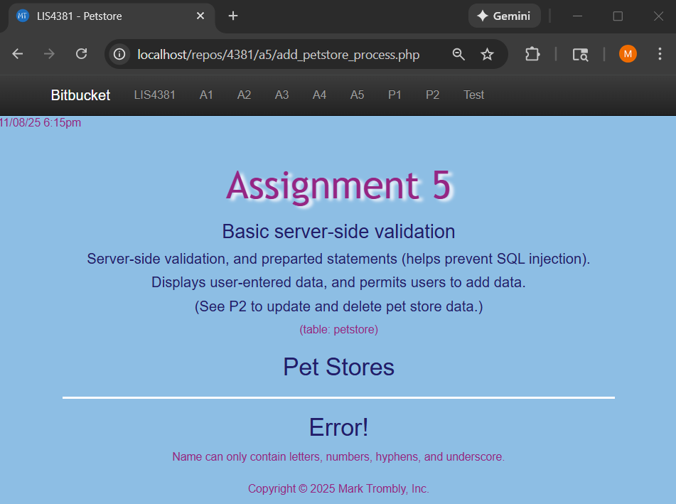
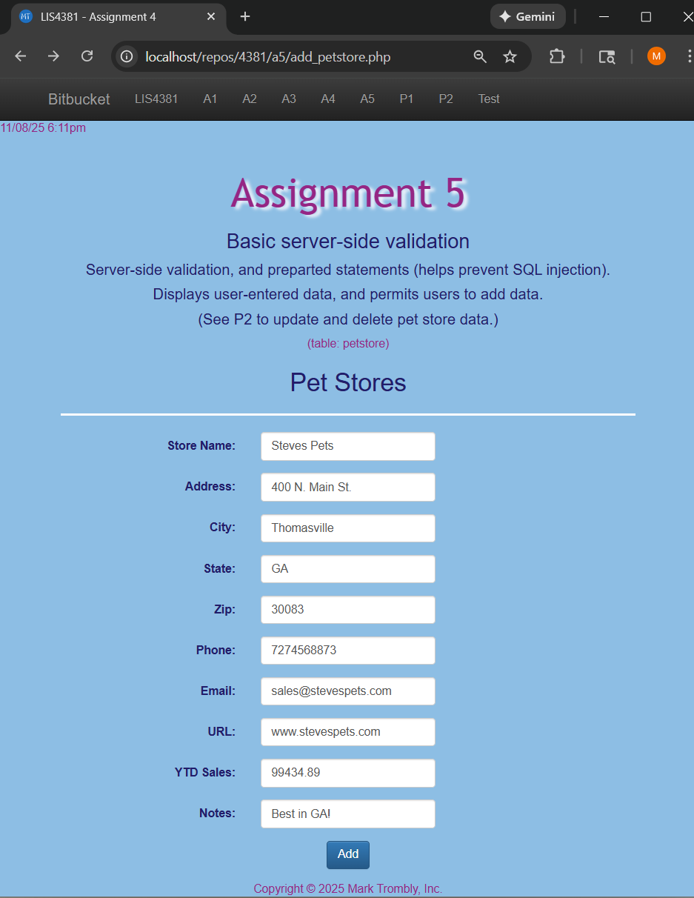
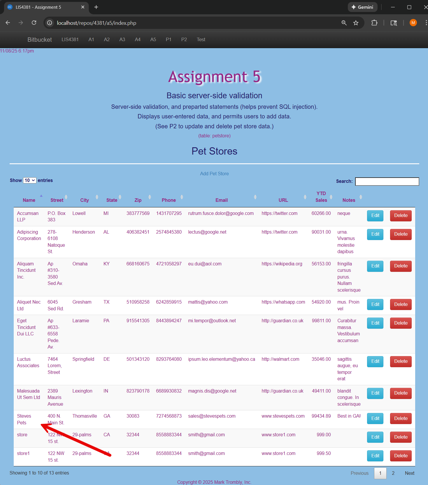

# LIS4381 - Mobile Web Application Development

## Mark Trombly

### Assignment #5 Requirements:

*Six Parts:*

1. Create PHP petstore app using Bootstrap to show client side and server side data validation.
2. Connect PHP petstore application to database for adding records.
3. Skillset 13 - Sphere Volume Calculator
4. Skillset 14 - PHP : Simple Calculator
5. Skillset 15 - PHP : Write/Read File
6. Chapter Questions (Ch 11,12, 19)

#### README.md file includes the following items:

* Screenshot of Petstore Main page
* Screenshot of Petstore Add Invalid Data (Client Side)
* Screenshot of Petstore Add Failed Validation (Server Side)
* Screenshot of Petstore Add Valid Data (Client Side)
* Screenshot of Petstore Add Passed Validation (Server Side)
* Screenshot Skillset 13 - Sphere Volume Calculator
* Screenshot Skillset 14 - PHP : Simple Calculator
* Screenshot Skillset 15 - PHP : Write/Read File
* Bitbucket repository link

#### Assignment Screenshots:

#### Screenshot of Main page:

#### Screenshot of Invalid Data:

#### Screenshot of Failed validation:

#### Screenshots of Valid Data:

#### Screenshots of Passed validation:

#### Skillsets:

|Skillset 13 - Sphere Volume Calculator|Skillset 14 - PHP : Simple Calculator|Skillset 15 - PHP : Write/Read File|
|--------|--------|--------|
|[Link to Skillset 13 Code](../skillsets/13_Sphere_Volume_Calculator/ "Link to Skillset 13 Code")|[Link to Skillset 14 Code](../skillsets/14_Simple_Calculator/ "Link to Skillset 14 Code")|[Link to Skillset 15 Code](../skillsets/15/Write_Read_File/ "Link to Skillset 15 Code") 
||||

#### Link to Local web app:

*Local Application*
[Local App Link](http://localhost/repos/4381/index.php "Local App Link")

#### Link to Simple Calculator web app:

*Simple Calculator Application*
[Simple Calculator App Link](http://localhost/repos/4381/simple_calculator/ "Simple Calculator App Link")

#### Link to Write/Read Text File web app:

*Write/Read Text File Application*
[Write/Read Text File App Link](http://localhost/repos/4381/write_read_file/ "Write/Read Text File App Link")

#### Repository Links:

*Bitbucket Repository*
[Bitbucket Repository Link](https://bitbucket.org/marktrombly/lis4381/src/master/ "Bitbucket Repository Link")