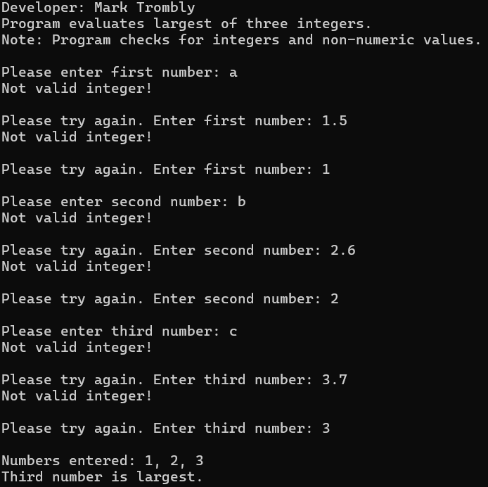
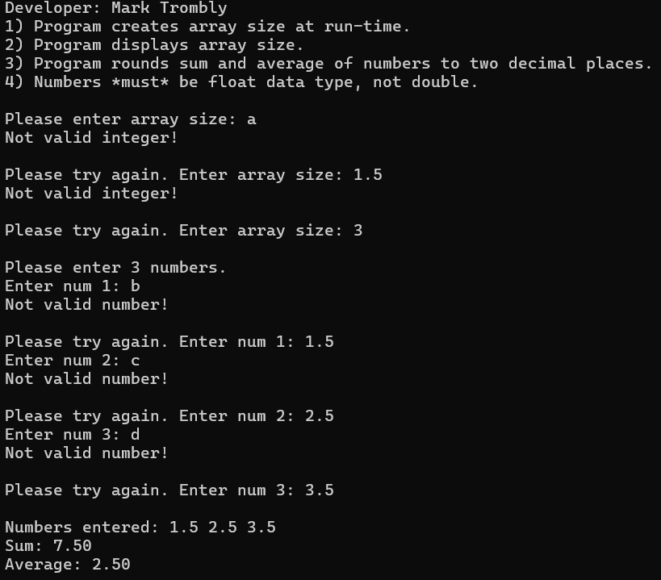

# LIS4381 - Mobile Web Application Development

## Mark Trombly

### Project #1 Requirements:

*Five Parts:*

1. Android Studio application - My Business Card.
2. Skillset 7 - Random Number Generator Data Validation.
3. Skillset 8 - Largest Three Numbers.
4. Skillset 9 - Array Runtime Data Validation.
5. Chapter Questions (Ch 7,8)

#### README.md file includes the following items:

* Screenshot of running Android Studio Application - My Business Card
* Screenshot Skillset 7 - Random Number Generator Data Validation
* Screenshot Skillset 8 - Largest Three Numbers
* Screenshot Skillset 9 - Array Runtime Data Validation
* Bitbucket repository link

#### Assignment Screenshots:

#### Screenshots of Android Studio Application - My Business Card:

| My Business Card Vertical                                                              | My Business Card Horizontal                                                   |
| :----------------------------------------------------------------------------------: | :------------------------------------------------------------------------------: |
|  |  |

|Skillset 7 - Random Number Generator Data Validation|Skillset 8 - Largest Three Numbers|Skillset 9 - Array Runtime Data Validation|
|--------|--------|--------|
|[Link to Skillset 7 Code](../skillsets/7_Random_Number_Generator_Data_Validation/ "Link to Skillset 7 Code")| [Link to Skillset 8 Code](../skillsets/8_Largest_Three_Numbers/ "Link to Skillset 8 Code")|[Link to Skillset 9 Code](../skillsets/9_Array-Runtime-Data-Validation/ "Link to Skillset 9 Code") 
||||

#### Repository Links:

*Bitbucket Repository*
[Bitbucket Repository Link](https://bitbucket.org/marktrombly/lis4381/src/master/ "Bitbucket Repository Link")