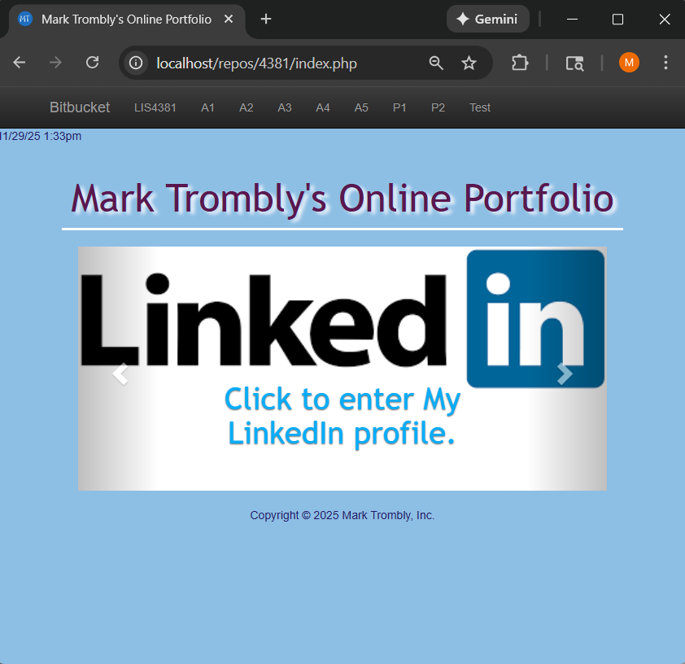
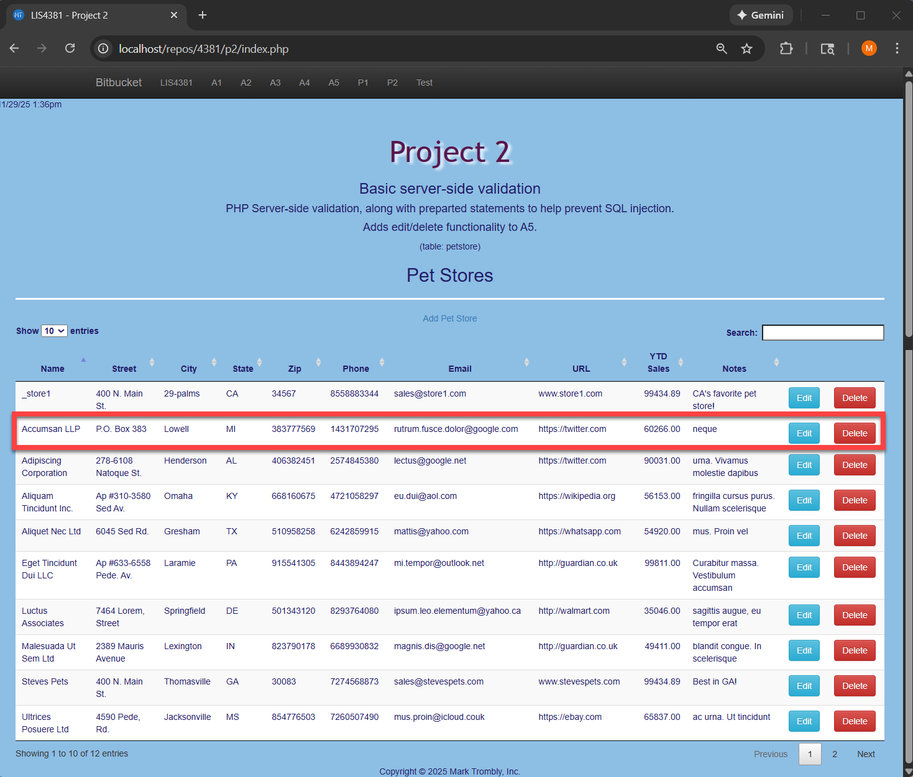
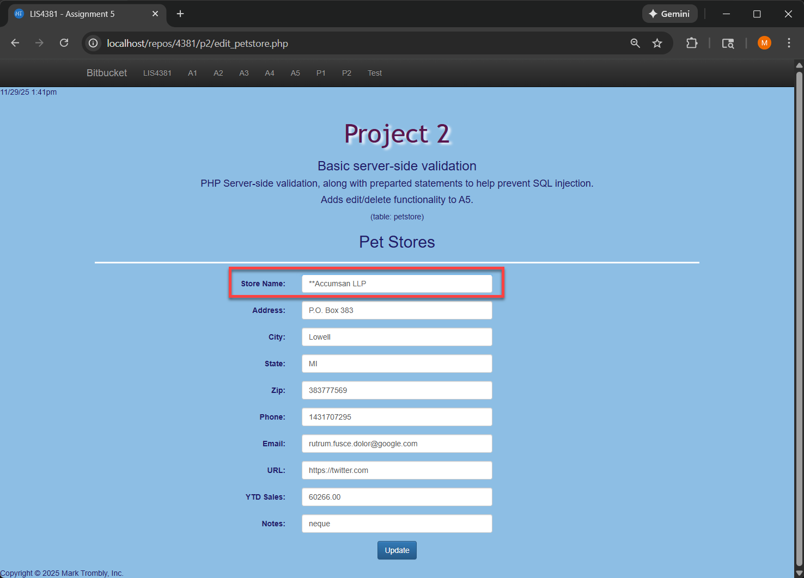
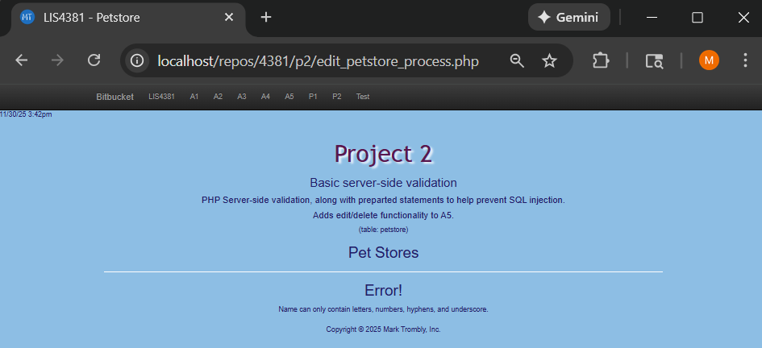
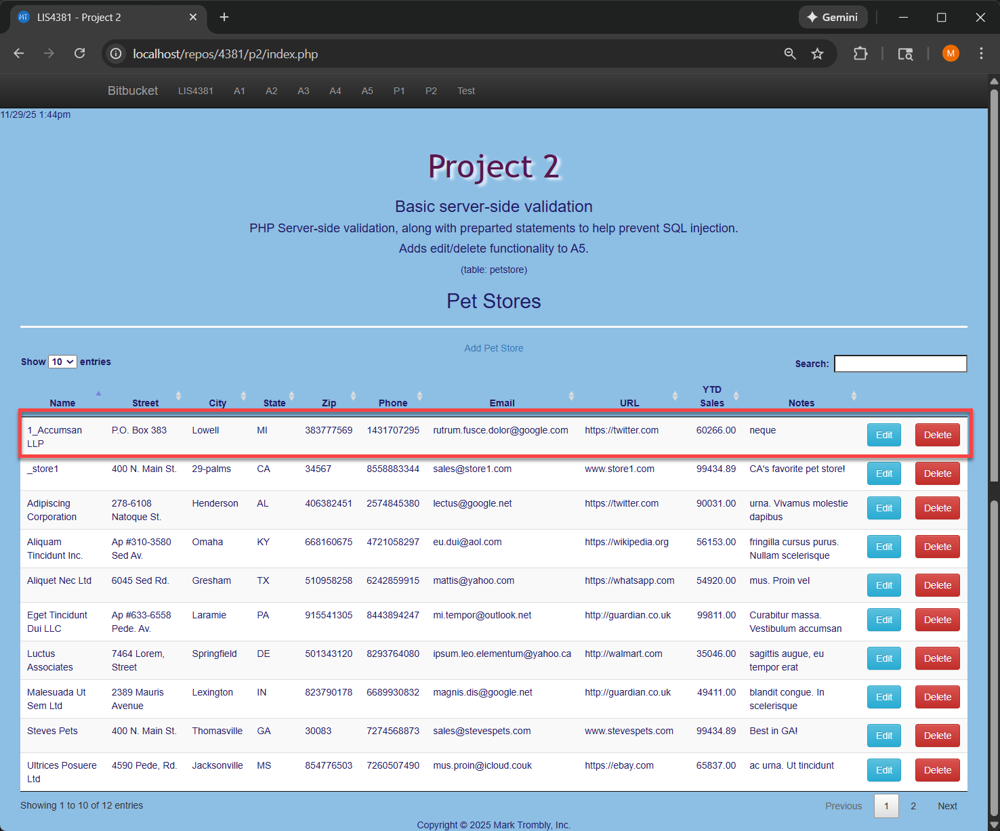
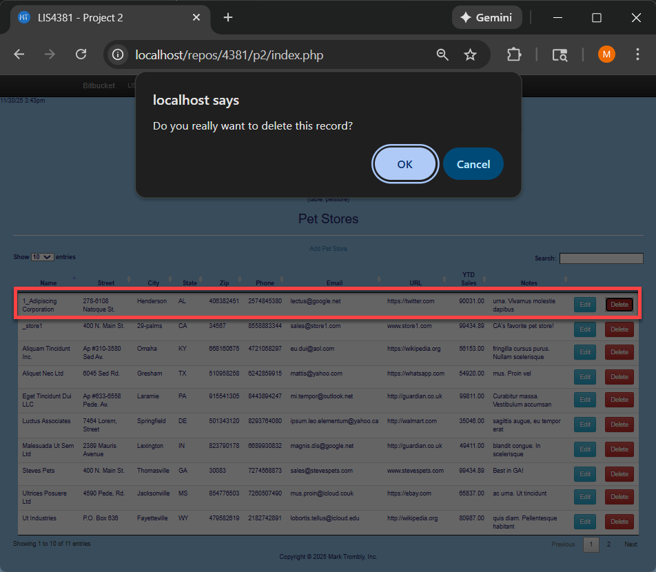
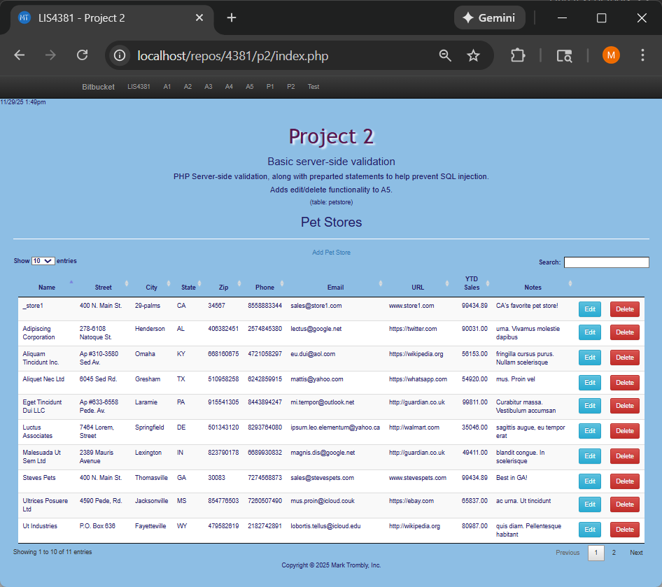
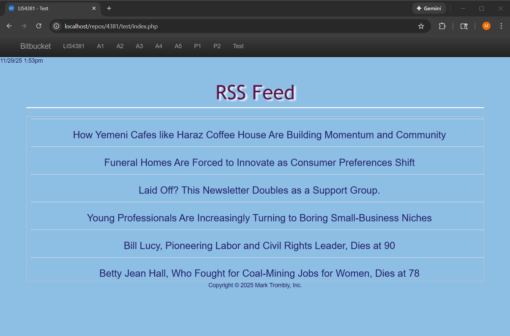

# LIS4381 - Mobile Web Application Development

## Mark Trombly

### Project #2 Requirements:

*Three Parts:*

1. Create PHP petstore app using Bootstrap to show server side data validation.
2. Connect PHP petstore application to database for edit and delete records.
3. Create RSS feed.

#### README.md file includes the following items:

* Screenshot of Main page
* Screenshot of Petstore Index page
* Screenshot of Petstore Edit page
* Screenshot of Petstore Edit page Failed Validation (server Side)
* Screenshot of Petstore Edit page Passed Validation (server Side)
* Screenshot of Petstore Delete page (prompt)
* Screenshot of Petstore Index page after record deletion
* Screenshot of RSS Feed
* Link to Local Web Application 
* Bitbucket repository link

#### Assignment Screenshots:

#### Screenshot of Main page:

#### Screenshot of Petstore Index page:

#### Screenshot of Petstore Edit page:

#### Screenshots of Petstore Edit page Failed Validation:

#### Screenshots of Petstore Edit page Passed Validation:

#### Screenshots of Petstore Delete page:

#### Screenshots of Petstore Index page after record deletion:

#### Screenshots of RSS Feed:

#### Link to Local web app:

*Local Application*
[Local App Link](http://localhost/repos/4381/index.php "Local App Link")

#### Repository Links:

*Bitbucket Repository*
[Bitbucket Repository Link](https://bitbucket.org/marktrombly/lis4381/src/master/ "Bitbucket Repository Link")